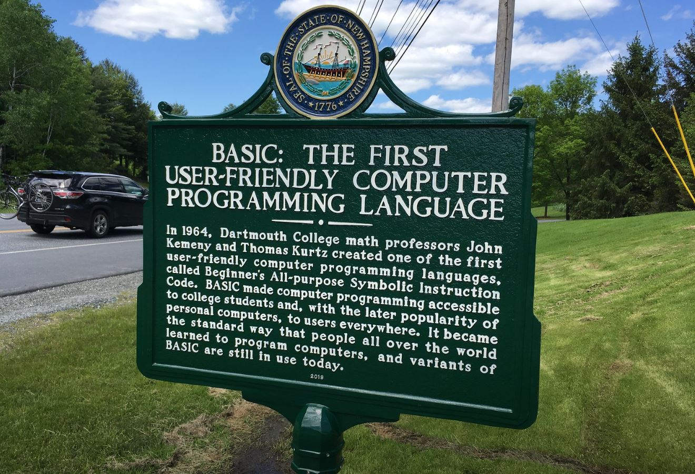

[Home](https://gotbasic.com) • [VB 7+](vb.md) • [VB 1-6](vb6.md) • [FB](freebasic.md) • [QB64](qb64.md) • [QB45](qb.md) • [GW-BASIC](gw-basic.md) • [Arduino](avr.md) • [Retro](micros.md)

# GotBASIC.com

The overall goal of [GotBASIC.com](https://gotBASIC.com) is to be the **GOTO** (<-- see what I did there?) website for __**ALL**__ things related to the **BASIC** computer language; a sort-of  one-stop source for every dialect and central hub for all versions (past-and-present) of **BASIC** in all its forms.

So please help me help everyone with this project; if you are aware of **BASIC**-related content floating around somewhere around on the web, please let me know.  If you are a product manufacturer of a product related to **BASIC**; please reach out to me so we can work with one another.  If you are working on a project using **BASIC**, please let me know so that I can help spread the word!

And remember...

> You can please some of the people all of the time, you can please all of the people some of the time, but you can’t please all of the people all of the time. ― John Lydgate

## General Links

- [Where it all started.](https://www.dartmouth.edu/basicfifty/basicmanual_1964.pdf)

- Love BASIC? Have questions?  Want to get more involved?  Join us on...
  - [Gitter](https://gitter.im/GotBASIC/community)
  - [Facebook](https://www.facebook.com/groups/gotbasic)
- [Wikipedia - List of BASIC dialects](https://en.wikipedia.org/wiki/List_of_BASIC_dialects)
- [COMMAND_LINE HEROES - Season 3, Episode 2 - Learning the BASICs](https://www.redhat.com/en/command-line-heroes/season-3/learning-the-basics)  

## Sitemap (work-in-progress)

- [Microsoft Visual Basic (.NET)](vb.md)
- [Microsoft Visual Basic (pre-.NET)](vb6.md)
- [Microsoft QuickBASIC, PDS BASIC (QBX) and QBasic](qb.md)
- [Microsoft GW-BASIC](gw-basic.md)
- [QB64](qb64.md)
- [FreeBASIC](freebasic.md)
- [Just BASIC](justbasic.md)
- [BCX](bcx.md)
- [Chipmunk BASIC](chipmunk.md)
- [BlitzBASIC](blitz.md)
- Microcontrollers
  - [AVR](avr.md)
  - [PIC32](pic32.md)
- [Micros](micros.md) (Retrocomputing)
  - [Atari 600XL and 800XL](atari.md)
  - [Commodore Amiga](amiga.md)
  - [Commodore C64](c64.md)
  - [Tandy/RadioShack Color Computer Series](coco.md)
- [Single-board Computer Projects](SingleBoard.md)
- [Other...](other.md)
