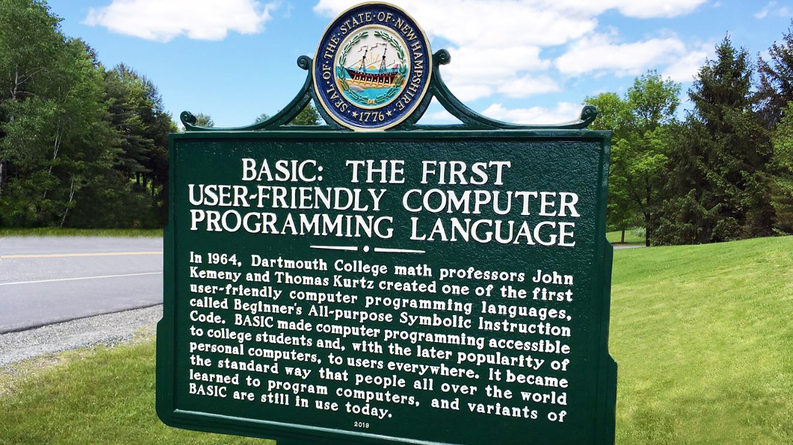

[Home](https://gotbasic.com) • [VB 7+](vb.md) • [VB 1-6](vb6.md) • [FB](freebasic.md) • [QB64](qb64.md) • [QB45](qb.md) • [GW-BASIC](gw-basic.md) • [Micro](micro.md) • [Retro](retro.md)

# GotBASIC.com

The overall goal of [GotBASIC.com](https://gotBASIC.com) is to be the **GOTO** (<-- see what I did there?) website for __**ALL**__ things related to the **BASIC** computer language; a sort-of one-stop source for every dialect and central hub for all versions (past-and-present) of **BASIC** in all its forms.

So please help us help everyone with this project; if you are aware of **BASIC**-related content floating around somewhere around on the web, please let me know.  If you are a product manufacturer of a product related to **BASIC**; please reach out to me so we can work with one another.  If you are working on a project using **BASIC**, please let me know so that I can help spread the word!

And remember...

> You can please some of the people all of the time, you can please all of the people some of the time, but you can’t please all of the people all of the time. ― John Lydgate

## Love BASIC?

Want to hang out and chat with others that also have an unwavering fascination with BASIC? Have general questions/comments? Want to share your experience? Want to simply get more involved? Join us on...

- [Discord](https://discord.gg/AYcgDwERUU)
- [Facebook](https://www.facebook.com/groups/gotbasic)

## General Links

- Where it all started...
  - [BASIC Manual (v1)](https://www.dartmouth.edu/basicfifty/basicmanual_1964.pdf)
  - [BASIC Manual (v2)](http://www.bitsavers.org/pdf/dartmouth/BASIC_Oct64.pdf)
  - [Birth of BASIC (YouTube)](https://youtu.be/WYPNjSoDrqw)
  - [BASIC at 50 (YouTube)](https://youtu.be/gxo9LVIgOiI)
  - [A basic history of BASIC on it's 50th birthday](https://www.gamedeveloper.com/business/a-basic-history-of-basic-on-its-50th-birthday)
  - [Photo of John G. Kemeny circa 1971](https://www.facebook.com/photo.php?fbid=3231692710177167&set=gm.2801583449951637&type=3&eid=ARBtSSg1CovWA2io5tfAxHmmAPipYiSrENWlV7gpvv7y37WUdFsJ9hCG0VFfODJdf76_IVQ3k6fOEczC&ifg=1)
  - [Mary Kenneth Keller (Wikipedia)](https://en.wikipedia.org/wiki/Mary_Kenneth_Keller)
  - [BASIC Necessities: How GE Helped Launch The Computing Language That Changed The World](https://www.ge.com/reports/basic-necessities-how-ge-helped-launch-the-computing-language-that-changed-the-world/)
  - [History of Microsoft - 1975](https://youtu.be/BLaMbaVT22E)
  - [A re-tracing of how Paul Allen loaded BASIC on the MITS Altair 8800 from paper tape](https://youtu.be/2wEyqJnhec8)
  - [Altair BASIC Manual](http://www.virtualaltair.com/virtualaltair.com/PDF/AltairBasic_1275.pdf)
- [Why Johnny can't code](https://www.salon.com/test2/2006/09/14/basic_2) by David Brian
- [Wikipedia - List of BASIC dialects](https://en.wikipedia.org/wiki/List_of_BASIC_dialects)
- [COMMAND_LINE HEROES - Season 3, Episode 2 - Learning the BASICs](https://www.redhat.com/en/command-line-heroes/season-3/learning-the-basics)  
- [Usborne Computer and Coding Books (Pdf)](https://usborne.com/us/books/computer-and-coding-books)
- [BASIC vs. FORTRAN 77](https://opensource.com/article/23/4/basic-vs-fortran-77): Comparing programming blasts from the past.

## BASICS

- [BASIC Source Repository](http://www.qbasicnews.com/abc/index.php)
- [64K BASIC](http://www.basic-lang.org/): The BASIC Programming Language: Microcomputer Edition (in Rust). [GitHub](https://github.com/AE9RB/basic-lang)
- [AMOS2](http://amos2.tech/en-us/): After 30 years, [AMOS](https://en.wikipedia.org/wiki/AMOS_%28programming_language%29)/STOS are begin recreated by the [original author](http://storyofamos.blogspot.com/) targeting HTML5/Javascript.
- [AOZ Studio](aozstudio.md)
- [AppGameKit](https://www.appgamekit.com/): AppGameKit is an easy to learn game development engine, ideal for Beginners, Hobbyists & Indie developers.  From the creators of Dark Basic.
- [Applesoft BASIC in Javascript](https://www.calormen.com/jsbasic/)
- [B#](bsharp.md)
- [B4X](b4x.md)
- [BabaBASIC (GitHub)](https://github.com/ianatha/bababasic): QuickBASIC 4.5 revival on Android
- [BaCon - BASIC to C Converter](http://www.basic-converter.org/): BaCon is a free BASIC to C translator for Unix-based systems, which runs on most Unix/Linux/BSD platforms, including MacOSX. It intends to be a programming aid in creating tools which can be compiled on different platforms (including 64bit environments), while trying to revive the days of the good old BASIC.  
- [Bas 2.5](http://www.moria.de/~michael/bas/): Bas is an interpreter for the classic dialect of the programming language BASIC. It is pretty compatible to typical BASIC interpreters of the 1980s, unlike some other UNIX BASIC interpreters, that implement a different syntax, breaking compatibility to existing programs. Bas offers many ANSI BASIC statements for structured programming, such as procedures, local variables and various loop types. Further there are matrix operations, automatic LIST indentation and many statements and functions found in specific classic dialects. Line numbers are not required.
- [BASIC Anywhere Machine](bam.md)
- [BASIC1](http://www.sydneysmith.com/wordpress/basic1/?fbclid=IwAR3ZQ-9yryCDGDKrC4pQWdZBB8oNKw-DN6U6xB9zMXgKFk8V6_s7sb2mPcU)
- [BASIC256](http://basic256.org/): BASIC-256 is an easy to use version of BASIC designed to teach anybody (especially middle and high-school students) the basics of computer programming. It uses traditional control structures like gosub, for/next, and goto, which helps kids easily see how program flow-control works. It has a built-in graphics mode which lets them draw pictures on screen in minutes, and a set of detailed, easy-to-follow tutorials that introduce programming concepts through fun exercises. Also check out [The "So you wan tto learn" Project](http://www.basicbook.org/).
- [Basic4GL](https://www.basic4gl.net/): Write programs in BASIC on your PC - then run them on your Android phone or tablet.
- [BASIC8](https://github.com/paladin-t/b8): An integrated *Fantasy Computer* for game and other program development where you can create, share and play disks in a modern BASIC dialect with built-in tools for editing sprites, tiles, map, quantized, etc.
- [BasiEgaXorz](https://segaretro.org/BasiEgaXorz): BASIC compiler for the Sega Genesis consoles. [Documentation](http://devster.monkeeh.com/sega/basiegaxorz/basiegaxorz_full.html)
- [BBC BASIC](bbc.md)
- [BCX](bcx.md)
- [Blassic](http://blassic.net/): Blassic is a classic Basic interpreter. The line numbers are mandatory, and it has PEEK & POKE. The main goal is to execute programs written in old interpreters, even those that use peculiar control flow constructs or automodifiable code. However, it can be used as a scripting language, and has some not-so-classic instructions. It has graphics modes that are compatible with some classic systems and user defined. 
- [BlitzBASIC](blitz.md)
- [bootBASIC](https://github.com/nanochess/bootBASIC): bootBASIC is a BASIC language in 512 bytes of x86 machine code.
- [Bywater BASIC](bywater.md)
- [Canon Basic](https://chdk.fandom.com/wiki/Canon_Basic): Canons firmware includes a scripting language, which appears to be a flavor of BASIC, for the VxWorks and DryOS cameras.
- [Centurion BASIC](centurion.md): Kickin' it old-school on a genuine mini-computer.
- [Cerberus-X](https://www.cerberus-x.com/community/index.php?pages/about/): Cerberus X is a cross platform development tool based on Monkey X from Mark Sibly. Its easy to learn programming language allows you to create apps or games on multiple platforms. To achieve this, Cerberus X translates source code to native source code of one of the different target platforms and creates an executable for you. [on Github](https://github.com/cerberusxdev/cerberus)
- [Chipmunk BASIC](chipmunk.md)
- [Commando Basic](https://www.lucidapogee.com/?page=commandobasic): Designed to be easy for anyone to learn; it's simple but also powerful enough to handle serious tasks.
- [Craft Basic](https://www.lucidapogee.com/?page=craftbasic): A BASIC interpreter for Windows 95 and up for learning programming, making simple games, write code interactively, perform complex calculations, display cool graphics, build windows with forms and write useful scripts.
- [CVBasic](https://forums.atariage.com/topic/362182-colecovision-basic-compiler-cvbasic-v010/): Colecovision BASIC compiler.
- [Decimal BASIC](http://hp.vector.co.jp/authors/VA008683/english/): Decimal BASIC is a programming environment for those who write programs for their own investigation. Decimal BASIC adopts ANSI/ISO Full BASIC as its syntax, because Full BASIC has suitable facilities for those who are unacquainted with the peculiar knowledge about computers.
- [DolyeSoft BASIC 2.0](http://doylesoft.com/BASIC/?i=1): DoyleSoft BASIC, is a free, BASIC-like scripting language and IDE for all 32 and 64 bit versions of Windows.
- [Dragon BASIC compiler for Game Boy Advance](https://github.com/uli/dragonbasic)
- [EndBASIC](https://github.com/jmmv/endbasic): BASIC interpreter with a REPL and a web interface written in Rust. [HACKADAY Article](https://hackaday.com/2023/09/17/the-end-of-basic/)
- [Enhanced BASIC (EhBASIC)](ehbasic.md)
- [Euphoria](https://openeuphoria.org/): A powerful but easy-to-learn programming language. It has a simple syntax and structure with consistent rules, and is also easy to read. You can quickly, and with little effort, develop applications, big and small, for Windows, Unix variants (Linux, FreeBSD, ...) and OS X.
- [Express BASIC](https://www.lucidapogee.com/?page=expressbasic): A minimal BASIC dialect with an open source and cross platform interpreter written in C inspired by Dartmouth, Palo Alto, Altair, GW-BASIC and the many dialects of Tiny BASIC.
- [FreeBASIC](freebasic.md)
- [FTC BASIC](https://www.lucidapogee.com/?page=ftcbasic): Fast Tiny Compiled BASIC; a compiler for x86 DOS written in QuickBasic and generates FASM output.
- [Fuze4 - Nintendo Switch](https://www.fuze.co.uk/nintendo-switch.html)
- [Gambas Almost Means BASIC!](gambas.md)
- [GFA-BASIC 32 for Windows](gfa.md)
- [GLBasic SDK](https://store.steampowered.com/app/819510/GLBasic_SDK/): An easy to learn BASIC language with Editor, Compiler and Debugger.
- [GNU LibertyBasic Compiler Collectio Project](http://lbpp.sourceforge.net/): A collection of user friendly, fully open sourced B.A.S.I.C Linux~Win32 compilers!
- [Microsoft GW-BASIC](gw-basic.md)
- [Hollywood](https://www.hollywood-mal.com/): A multimedia-oriented programming language that can be used to create applications and games very easily.
- [Hyundai Robotics BASIC](https://hyundai-robotics.com/english/product/product4_view.html?no=5): The Hi5a-S apparently uses a verion of BASIC.
- [ipplesoftbasic](https://code.google.com/archive/p/ipplesoftbasic/): A free BASIC interpreter written entirely in JavaScript that is cross-platform but primarily intended to specifically target the iPhone.
- [JavaScript BASIC](https://eder.us/projects/jbasic/): JavaScript BASIC Interpreter.
- [JsBasic (GitHub)](https://github.com/dualbrain/jsbasic): A BASIC to Javascript transpiler (implemented in VB / .NET 7+) based, in part, on the [JSBasic (GitHub) C# project](https://github.com/danielflower/JSBasic) and [associated CodeProject article](http://www.codeproject.com/Articles/25069/JSBasic-A-BASIC-to-JavaScript-Compiler). [JsBasic (GitHub)](https://github.com/dualbrain/jsbasic) has several improvements over the the original.
- [Just BASIC](justbasic.md)
- [Kaya-BASIC (GitHub)](https://github.com/kankouhin/Kaya-BASIC): Multi-platform BASIC compiler, supports Windows, Linux and MacOS.  (Based on the B++ compiler.)
- [Locomotive BASIC interpreter written in Haskell](https://github.com/jarmond/locomotive-haskell)
- [m4basic](http://www.basic-converter.org/m4basic/): BASIC to C converter based on M4
- [Mallard BASIC](https://en.m.wikipedia.org/wiki/Mallard_BASIC): A BASIC interpreter for CP/M produced by Locomotive Software and supplied witht he Amstrad PCW range of small business computers, the ZX Spectrum +3 version of CP/M Plus and the Acorn BBC Micro's Zilog Z80 second processor.
- [MiniScript](https://miniscript.org/): A simple, elegant language for embedding or learning to program.
- [MMBasic](mmbasic.md)
- [Mole Basic](https://merty.home.xs4all.nl/mole/): Merty's Own Language Extension basic (MOLE basic) is an interpreter originally written to implement a simple (IF-THEN-ELSE) kind of language, usable in a IBM messaging switching environment. BASIC is choosen because I couldn't think of an easier language to learn which is so well-known and still usable for small and simple tasks.In time, the program grew and I decided to rewrite it in my own time, strip out all IBM-message switch related commands and release it to the public. Although the source is a bit of a mess right now, using lex and yacc makes it easy to adopt your own command(s) inside it, without bothering about interpreting commandlines and expressions.
- [MoonRock](moonrock.md)
- [NaaLaa](https://www.naalaa.com/): 'Not An Advanced Language At All' is a very easy to learn programming language for beginners interested in retro style game development.
- [NEXTBasic](https://alcatstudio.blogspot.com/p/nextbasic-compiler.html): A customized Basic language, inspired by Visual Basic .NET, that targets the Sega Genesis (Mega Drive).
- [NG-BASIC](https://sourceforge.net/projects/ng-basic/): An experimental BASIC language that can be both interpreted within an IDE as well as compiled to a native executable.
- [nuBASIC](https://www.nubasic.eu): nuBASIC is a programming language from the BASIC family, designed by the author, Antonino Calderone, mainly for educational purposes both for C++ developers that can deal with a non-trivial example of modern C++ programming and for beginners, which may get hooked on programming. ([SourceForge](https://sourceforge.net/projects/nubasic/))
- [Oxygen Basic](oxygen.md)
- [PowerBASIC](powerbasic.md)
- [PuffinBASIC](https://github.com/mayuropensource/PuffinBASIC): BASIC interpreter written in Java
- [PureBasic](purebasic.md)
- [Microsoft QuickBASIC, PDS BASIC (QBX) and QBasic](qb.md)
- [qb.js](http://stevehanov.ca/blog/index.php?id=92): an implementation of QBASIC in Javascript.
- [qb2c](https://fossies.org/linux/misc/old/qb2c-3.43.tgz/): a (Quick)BASIC to C translator.
- [QB64](qb64.md)
- [QBJS](qbjs.md)
- [QuickBASIC Clone (Unfinished)](qbc.md)
- [QuickBasic compiler clone](qbc.md): Stated purpose is to provide tools for running QuickBASIC programs in Linux and other non-MS-DOS-environments.
- [Quite BASIC](https://www.quitebasic.com/)
- [RAD Basic](radbasic.md)
- [RBASIC](http://www.rbasic.com/): RBASIC (Radio Basic) is a rapid application development environment especially designed to make custom software development for software-defined radio receivers easier and more enjoyable. 
- [RCBASIC](http://rcbasic.com/): Programming language designed to simplify writing 2D games and applications. [More info...](https://n00bcode.itch.io/rcbasic-basic-programming-language-for-games) and [GitHub](https://github.com/n00b87/rcbasic3)
- [RFO BASIC!](http://rfo-basic.com): The Dr. Richard Feynman Observatory BASIC! for Android.  ([Forum](https://www.tapatalk.com/groups/rfobasic/)) ([Google Play](https://play.google.com/store/apps/details?id=com.rfo.compiler))
- [RTB - BASIC](https://projects.drogon.net/rtb): Return to Basics, or RTB, is a programming language inspired by the BASIC programming language that was used on the microcomputers of the late 1970s and 1980s.  As well has having an interactive allowing program entry, debugging, listing and so on in the same way as traditional BASIC has with line numbers, it also takes a more modern approach with a full-screen syntax highlighting editor which allows easier program entry without line-numbers, a unified looping construct, multi-line if/then/else statements, named procedures and functions and many more features to list here.  It currently runs on the Raspberry Pi under Raspbian and other Linux systems.
- [Run BASIC](http://www.runbasic.com/): Run BASIC Personal Server is an all-in-one system that makes web programming easy and fun. With a knowledge of the BASIC programming language and without needing to learn a lot of arcane web technologies you can create web applications for use on a PC, for use on a local network, or hosted onto the Internet. Run BASIC applications work on Windows, Linux and Mac computers and many cell phones.
- [Script BASIC](https://www.scriptbasic.org/)
- [Script BASIC (on SourceForge)](https://sourceforge.net/projects/scriptbasic/)
- [ScriptBasic for Java](https://github.com/verhas/jScriptBasic): A BASIC interpreter that can be embedded into Java programs providing the ability to script your application (or let the users to script) in good old BASIC.
- [SDLBasic](https://www.sdlbasic.altervista.org/main/index.html): SDLBasic is a BASIC interpreter that integrates the WxBasic interpreter, the SDL graphics library, and a graphics engine, so that you can use it to write 2D games.
- [SecondBASIC Studio](secondbasic.md)
- [Simple Web Basic](https://yohan.es/swbasic/)
- [SpecBAS](specbas.md)
- [SpiderBasic](spiderbasic.md)
- [Squanchy-BASIC](https://github.com/tlindner/Squanchy-BASIC): Color BSAIC, improved.
- [SmallBASIC](smallbasic.md)
- [Microsoft Small Basic](mssb.md)
- [TeleBASIC (GitHub)](https://github.com/telehack-foundation/.github/blob/main/basic.md): TeleBASIC is the flavor of BASIC (Beginners' All-purpose Symbolic Instruction Code), used on [Telehack](https://telehack.com/). TeleBASIC is based on the original Dartmouth BASIC, but with a large number of additional features, such as support for regular expressions, UNIX timestamps, many common hashing/encoding algorithms, multi-dimensional arrays, and the ability to use alphanumeric indices.
- [Terminal BASIC](https://github.com/terminal-basic-team): A lightweight BASIC-like language interpreter written in C++11 that is cross-platform with a primary target of uC-based systems like Arduino with at least 32kb of program memory that is inspired by Tiny and Dartmouth BASIC dialects.
- [thinBASIC](thinbasic.md)
- [Tiny BASIC](tiny.md)
- [Tiny BASIC](http://tinybasic.cyningstan.org.uk/): Welcome to Damian Gareth Walker's Tiny BASIC Portal! Tiny BASIC is a subset of the BASIC programming language, originally developed in 1975 by Dennis Allison and others. It was designed for hobbyists who couldn't afford the cost of a full Microsoft BASIC package, or didn't have enough memory to run it. It was meant to be easily extensible, and people extended it from pretty early on.
- [TNT Basic](http://tntbasic.com/): TNT Basic is the easiest way to make your own games for the Mac!
- [ToyBASIC (GitHub)](https://github.com/demosthenesk/ToyBASIC): A BASIC interpreter written in FreeBASIC.
- [True BASIC](truebasic.md)
- [twinBASIC](twinbasic.md)
- [ugBASIC](ugbasic.md)
- [UBASIC-PLUS](https://github.com/mkostrun/UBASIC-PLUS): uBasic Plus for microcontrollers adds features to uBasic such as arrays and floating point numbers, more functions and ability to control hardware (analog read/write,digital write, et c.) all while improving internal workings of the interpreter. It is centered around ARM Cortex M0 processors.
- [Vintage BASIC](http://www.vintage-basic.net/): Vintage BASIC is an interpreter for a programming language of days gone by. A time when every home computer had a simple language called BASIC, and every kid who owned a computer learned it. It is implemented in Haskell, a modern language very unlike BASIC. Lyle Kopnicky constructed it as a way to demonstrate how Haskell's monads could be used to implement BASIC's dynamic control structures. This odd marriage has now produced a fully functional implementation of that old favorite.
- [Microsoft Visual Basic (.NET)](vb.md)
- [Microsoft Visual Basic (pre-.NET)](vb6.md)
- [Google's wwwBASIC](wwwbasic.md)
- [wxBasic](wxbasic.md)
- [Xojo](xojo.md)
- [XBasic](http://www.maxreason.com/software/xbasic/share.html): XBasic is a comprehensive program development environment that integrates a powerful editor, compiler, debugger, function libraries and GuiDesigner into a seamless working environment that encompasses the whole process of creating fast, efficient, reliable, portable 32/64 bit programs.  See XBasic overview. Compatible and equivalent implementations of XBasic are available for Windows95/98/NT and Linux.  XBasic is written entirely XBasic, plus a little assembly language.  XBasic is open-source freeware released under the standard GPL and LGPL licenses to assure all enhancements and derivatives remain open-source.
- [Yabasic](http://www.yabasic.de/): Yet another Basic (also on [GitHub](https://github.com/marcIhm/yabasic)).
- [ZBASIC](https://forum.classic-computing.de/forum/index.php?thread/23136-zbasic-v3-03-von-zedcor-fuer-cp-m/&l=2)

## Platforms

- [Single-board Computers](singleboard.md)
  - [Agon light™](agon.md)
  - [BASIC Engine](https://basicengine.org/)
  - [Colour Maximite](cmm1.md)
  - [Colour Maximite 2](cmm2.md)
  - [Raspberry Pi](pi.md)
  - [More...](singleboard.md)
- [Microcontrollers](micro.md)
  - [AVR (Arduino)](avr.md)
  - [ESP-8266](esp.md)
  - [PIC](pic.md)
  - [Micromite](micromite.md)
  - [More...](micro.md)
- [Personal Computers (Retro)](retro.md)
  - [Amstrad CPC](amstrad.md)
  - [Apple II](apple.md)
  - [Atari 600XL and 800XL](atari.md)
  - [Commodore Amiga](amiga.md)
  - [Commodore C64](c64.md)
  - [Commodore PET](pet.md)
  - [Commodore VIC-20](vic20.md)
  - [Microbee Technology Microbee](microbee.md)
  - [RadioShack TRS-80 Series](trs80.md)
  - [Tandy/RadioShack Color Computer Series](coco.md)
  - [More...](retro.md)
- [Console (Retro)](console.md)
  - Atari 2600
  - Atari 7800
  - ColecoVision
  - Mattel Intellivision
  - Nintendo NES
  - Sega Genesis/MegaDrive

## Not Quite BASIC (aka BASIC-esque)

Although the following aren't BASIC in the classical sense, many of these have languages that are clearly inspired by (or at the very least, clearly share similarities with) BASIC (credited or not).

- [Mini Micro fantasy computer](https://miniscript.org/MiniMicro/#about): A neo-retro virtual computer for learning to code, play some games and join a friendly, enthusiastic community of hobbyists. ([MiniScript Quick Reference](https://miniscript.org/files/MiniScript-QuickRef.pdf))
- [Easylang](https://easylang.online/): Easy online programming language and development environment for teach and learning programming.
- [microStudio](https://microstudio.dev/projects/): Create games, learn programming, play, share, prototype and jam!
- [Sonic Pi](https://sonic-pi.net/): A code-based music creation and performance tool.

## TODO

- [Other...](other.md)

## WOW! just WOW!

- [BlueBasic: BASIC for Bluetooth](https://hackaday.io/project/2386-bluebasic-basic-for-bluetooth): This hackaday.io project contains a BASIC interpreter which can be flashed onto a CC2540 or CC2541 Bluetooth module. Once installed, simple use the Bluetooth Console tool to connect and start coding on the device using good old BASIC.
- [bz80: A ez80 emulator in TI-BASIC](https://www.cemetech.net/forum/viewtopic.php?t=16689&start=0): Also on [GitHub](https://github.com/commandblockguy/bz80).
- [mal - Make a Lisp](https://github.com/kanaka/mal): Provides a step-by-step guide for creating a LISP interpreter with implementations in BASIC (C64 and QBasic), BBC BASIC V and VB (.NET).

## Other Resources (Lists)

### Enthusiasts (People)

- [Mike Hawk Got Game](https://qbmikehawk.neocities.org/)
- ["RetroNick" on YouTube](https://www.youtube.com/channel/UCLak9dN2fgKU9keY2XEBRFQ) • [on GitHub](https://github.com/RetroNick2020/Channel-Code)

### Lists

- [The Basics' page (since 2001)](http://basic.mindteq.com/)
- [Retro Directory](https://retro.directory/)
