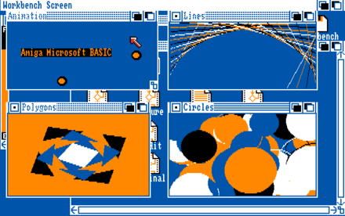
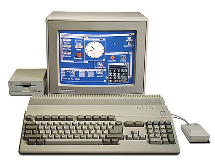

[Home](https://gotbasic.com) • [VB 7+](vb.md) • [VB 1-6](vb6.md) • [FB](freebasic.md) • [QB64](qb64.md) • [QB45](qb.md) • [GW-BASIC](gw-basic.md) • [Micro](micro.md) • [Retro](retro.md)

## AmigaBASIC

AmigaBASIC is a BASIC language implementation for the earlier line of Amiga personal computers, designed and written by Microsoft. AmigaBASIC shipped with AmigaOS versions 1.1 to 1.3. It succeeded ABasiC, which was initially included in AmigaOS 1.0 (possibly even on some early 1.1 disks), and discontinued in AmigaOS version 2.0 onwards.

AmigaBASIC provided not only the common BASIC language, but also attempted to provide an easy-to-use API for the Amiga's unique graphics and sound capabilities. `OBJECT` commands, for example, made it easy to create moving objects - sprites and bobs that could be drawn with an external drawing program, Object editor, that was supplied with AmigaBASIC.

### More

- [AQB](https://github.com/gooofy/aqb): A QuickBASIC-style Compiler and IDE for Amiga computers.
- [AMIBLITZ³](blitz.md): AMIBLITZ³ is a free Development environment for AmigaOS3.x and Compatible based on BlitzBasic.
- [MetaComCo ABasiC](https://archive.org/details/Amiga_BASIC_v1.0_1985_Commodore_Microsoft): Note that the entry is mislabeled, but a commenter pointed out which version of BASIC this actually is. See [MetaComCo](https://en.wikipedia.org/wiki/MetaComCo).

### Hardware Emulation (FPGA)

- [Amiga on MiSTer](https://www.mistercores.com/amiga-core/)

## Videos

- [Microsoft Amiga BASIC (Workbench 1.3)](https://youtu.be/fsOO5wIGl70)
- [How to install Amiblitz / Blitz Basic 3 on the Commodore Amiga running on WinUAW](https://youtu.be/BftEFLlSWhI)

## Books

- [Microsoft Amiga BASIC Manual](https://archive.org/details/AmigaBASIC1985Commodore/)
- [Amiga 3D Graphic Programming in BASIC](https://archive.org/details/Amiga3dGraphicProgrammingInBasic/mode/2up): A revealing book on how to use the spectacular and powerful graphic capabilities of the Amiga.

## Additional

- [BitmapFonts](https://github.com/ianhan/BitmapFonts): Collection of bitmap fonts pulled from various demoscene archives over the years.

