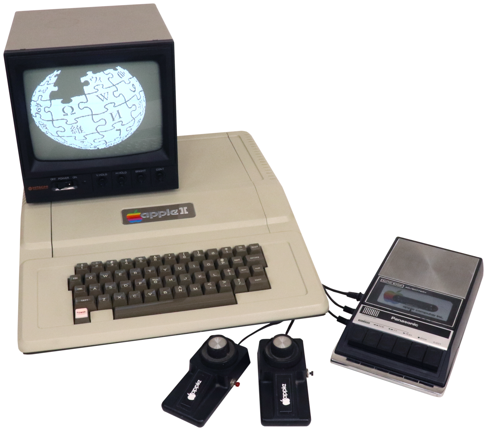

[Home](https://gotbasic.com) • [VB](vb.md) • [FB](freebasic.md) • [QB](qb.md) • [GW](gw-basic.md) • [Tiny](tiny.md) • [BBC](bbc.md) • [SpecBAS](specbas.md) • [A-Z](alphabetical.md) • [Platform](platform.md) • [Discord](https://discord.gg/AYcgDwERUU)

# Apple II

## Emulation/Simulation

- [Emulator (browser-based)](https://www.scullinsteel.com/apple2/) ([instructions](https://www.howtogeek.com/659450/how-to-write-an-apple-ii-basic-program-in-your-web-browser/?fbclid=IwAR0YrH_23twFC7hEpNALMlJ86nkOdVckDRmmYeSVMFh4f6LZuywlzNcJuaw))
- [Applesoft BASIC in JavaScript](https://calormen.com/jsbasic/): [On GitHub](https://github.com/inexorabletash/jsbasic)