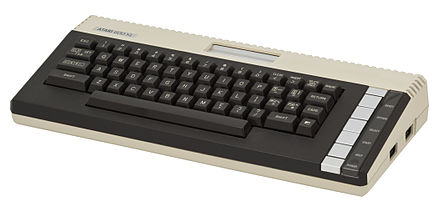
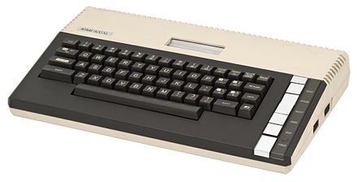

[Home](https://gotbasic.com) • [VB 7+](vb.md) • [VB 1-6](vb6.md) • [FB](freebasic.md) • [QB64](qb64.md) • [QB45](qb.md) • [GW-BASIC](gw-basic.md) • [Micro](micro.md) • [Retro](retro.md)

# Atari

## 2600

- [2600 (STELLA) Programmer's Guide by Steve Wright](https://archive.org/details/StellaProgrammersGuide)
- [Steve Guidi Video Companion Files (GitHub)](https://github.com/SteveGuidi/video-companion-media): Find some sample programs as well as a keyboard "overlay". He also has a project for connecting a PS2 keyboard to an Atari 2600!

### BASIC Programming

- [BASIC PROGRAMMING - ATARI GAME PROGRAM INSTRUCTIONS](https://archive.org/details/basic-programming-atari-2600-us)
- [Basic Programming - Atari - Atari 2600](https://atariage.com/manual_html_page.php?SoftwareID=852)
- [Try BASIC Programming on the Atari 2600 (15-30 mins)](https://atariprojects.org/2019/12/24/try-basic-programming-on-the-atari-2600-15-30-mins/)
- [Everything I Needed to Know About Programming I Learned from BASIC (Coding Horror)](https://blog.codinghorror.com/everything-i-needed-to-know-about-programming-i-learned-from-basic/)
- [Write Atari 2600 Video Games in BASIC](http://relationalframework.com/Atari2600gamesonline.htm)
- [Atari Mania - BASIC Programming](http://www.atarimania.com/game-atari-2600-vcs-basic-programming_7225.html)

### Atari Dev Studio

- [Atari Dev Studio for Homebrew Development [Release]](https://forums.atariage.com/topic/290365-atari-dev-studio-for-homebrew-development-release/)
- [Atari Dev Studio (GitHub)](https://github.com/chunkypixel/atari-dev-studio)
- [Atari Dev Studio (VSCode)](https://marketplace.visualstudio.com/items?itemName=chunkypixel.atari-dev-studio)

### batari Basic

- [batari-Basic: a BASIC-like language for creating games that run on the Atari 2600 console (GitHub)](https://github.com/batari-Basic/batari-Basic)
- [batari Basic Commands](https://www.randomterrain.com/atari-2600-memories-batari-basic-commands.html#ideforbb)
- [Official Home for batari Basic](https://forums.atariage.com/topic/300856-official-home-for-batari-basic/)
- [batari Basic (defunct website?)](https://bataribasic.com/)

## 7800

### Atari Dev Studio

- [Atari Dev Studio for Homebrew Development [Release]](https://forums.atariage.com/topic/290365-atari-dev-studio-for-homebrew-development-release/)
- [Atari Dev Studio (GitHub)](https://github.com/chunkypixel/atari-dev-studio)
- [Atari Dev Studio (VSCode)](https://marketplace.visualstudio.com/items?itemName=chunkypixel.atari-dev-studio)

## 600XL and 800XL

### Atari BASIC

Atari BASIC is an interpreter for the BASIC programming language that shipped with the Atari 8-bit family of 6502-based home computers. Unlike many 8-bit BASICs, Atari BASIC is not a derivative of Microsoft BASIC, and differs in significant ways. It includes keywords for Atari-specific features and lacks support for string arrays, for example. 

- [Atari BASIC on Wikipedia](https://en.wikipedia.org/wiki/Atari_BASIC)
- [Atari BASIC Reference Manual](https://archive.org/stream/atari-basic-reference-manual/ataribasicreferencemanual#page/n65/mode/2up)
- [Atari BASIC Source Book](https://archive.org/details/ataribooks-the-atari-basic-source-book) - A complete explanation of the inside workings of Atari BASIC, along with the original source.
- [Atari BASIC - A Self-teaching Guide](https://www.atariarchives.org/basic/)
- [Atari BASIC - XL Edition](https://www.atariarchives.org/basicxl/)

### FastBasic

This is a fast interpreter for the BASIC language on the Atari 8-bit computers and the Atari 5200 console.

- [FastBasic - Fast BASIC interpreter for the Atari 8-bit computers (GitHub)](https://github.com/dmsc/fastbasic)

## Emulation

- [AE8 Atari 800 XL Emulator](http://www.zerstoerung.de/)
- [jsA8E Demo](http://www.zerstoerung.de/jsa8e/)
- [JsA8E (JavaScript Atari 800 XL Emulator) online](http://atariage.com/forums/topic/224709-jsa8e-javascript-atari-800-xl-emulator-online/)

## Interesting Tidbits

- [Atari BASIC - The Good, the Bad, and the Ugly](https://web.archive.org/web/20070524044410/http://www3.sympatico.ca/maury/other_stuff/atari_basic.html)
- [Create your own version of Microsoft BASIC for 6502](https://www.pagetable.com/?p=46)
- [Atari BASIC (Archive.org)](https://archive.org/search.php?query=atari%20basic)
