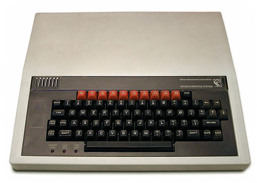
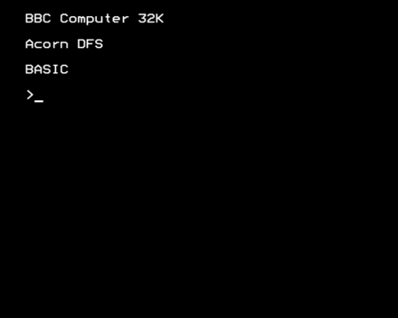

[Home](https://gotbasic.com) • [VB 7+](vb.md) • [VB 1-6](vb6.md) • [FB](freebasic.md) • [QB64](qb64.md) • [QB45](qb.md) • [GW-BASIC](gw-basic.md) • [Micro](micro.md) • [Retro](retro.md)

# BBC Micro

First, let's review about *where* BBC BASIC gained its foothold...

- [Emulator (browser-based)](https://bbc.godbolt.org/)
- [BBC Micro Users Guide](http://central.kaserver5.org/Kasoft/Typeset/BBC/Contents.html) ([PDF](http://bbc.nvg.org/doc/BBCUserGuide-1.00.pdf))
- [Learn to write games for the BBC Micro with Eben](https://www.raspberrypi.org/blog/learn-to-write-games-for-the-bbc-micro-with-eben/)
- [Books via 8-Bit Software](http://8bs.com/othrdnld/manuals/publications.shtml)
- [Wikipedia](https://en.wikipedia.org/wiki/BBC_BASIC)

## BBC BASIC

If you want to recreate the *old school* vibe, in the browser...

- [BBC BASIC EDITOR (Browser)](https://bbcmic.ro/#)

Or if you want to leverage BBC BASIC as it has evolved to work directly on modern hardware...

- [BBC BASIC](http://www.bbcbasic.co.uk/bbcbasic.html): Richard Russell's BBC BASIC portal.
- [BBC BASIC for SDL 2.0](http://www.bbcbasic.co.uk/bbcsdl/index.html): for Windows, Linux (86), MacOS, Raspberry Pi, Android and iOS. [on GitHub](https://github.com/rtrussell/BBCSDL)
- [BBC BASIC "Console Mode"](https://www.bbcbasic.co.uk/console)
- [QBASIC to BBC BASIC translator](https://www.bbcbasic.co.uk/qb2bbc/)
- [BBC BASIC (Z80)](https://www.bbcbasic.co.uk/bbcbasic/z80basic.html)
- [RISC OS Direct for Raspberry Pi](https://www.riscosdev.com/direct/): A RISC OS for Raspberry Pi image that has a particular emphasis on programing RISC OS and contains BBC BASIC 5/6 as well as many other programming languages pre-installed.
- [BASIC Tips & Tricks](https://web.archive.org/web/20190420181634/http://www.tristone.co.uk/davespace/basic/index.html)
- [Brandy](https://jaguar.orpheusweb.co.uk/branpage.html): An interpreter for BBC Basic (or Basic V as it is sometimes referred) that runs under a variety of operating systems such as RISC OS, NetBSD, OpenBSD, reeBSD, Linux, Mac OSX, Amiga OS, DOS (extender) and Windows.
- [Napoleon Brandy Basic V Interpreter](https://sourceforge.net/projects/napoleonbrandy/): Napoleon Brandy is development of David Daniels Brandy basic, an interpreter for BBC Basic (or Basic V), This project can not claim ANSI C compliance as Brandy Basic did, but supports Graphics for the platforms implemented. OS currently supported are Win32 and DOS. Currently a preview release as it is functionally incomplete.
- [Matrix Brandy BASIC VI](http://brandy.matrixnetwork.co.uk/): a multi-platform BBC BASIC VI interpreter with optional SDL graphics support, released under the GNU General Public Licence version 2+. It is a fork of David Daniels' Brandy BASIC, baselined at version 1.20.1 from his Sourceforge release, which hasn't seen any updates since 2014.

## Very Cool!!!!

- [BBC Micro Bot](https://twitter.com/bbcmicrobot): Welcome to 8-bit cloud.  Send a tweet to @bbcmicrobot and it will run it on a 1980s 8-bit computer emulation! [Source (GitHub)](https://github.com/8bitkick/BBCMicroBot)

## Additional Resources

- [Complete BBC Micro Games Archive](http://www.bbcmicro.co.uk/index.php)
- [The Mighty Micro (1979)](https://youtube.com/playlist?list=PL13dwmxpaKl5JJyC4L09uf_PFXkn6FlGA&si=QmiJuMFBl_05RT9r)
- [The Computer Programme (BBC2, 1982)](https://youtube.com/playlist?list=PLOtimvwAoYtnCtLiLspq_Gnng1XusYwPU&si=Grhr6VK9CQcui0L4)
- [RISC OS Programmer's Reference - The Window Manager](http://www.riscos.com/support/developers/prm/wimp.html)
- [btracker](https://github.com/davidgiven/btracker): A chiptracker editor and player for the BBC Micro.
