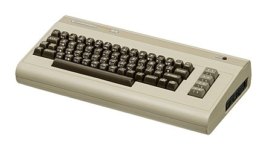

[Home](https://gotbasic.com) • [VB 7+](vb.md) • [VB 1-6](vb6.md) • [FB](freebasic.md) • [QB64](qb64.md) • [QB45](qb.md) • [GW-BASIC](gw-basic.md) • [Micro](micro.md) • [Retro](retro.md)

# Commodore C64

- [C64 Online Emulator](https://c64online.com/c64-online-emulator/)
- [Cloanto's C64 Forever](https://www.c64forever.com/)
- [VICE (Emulator)](https://vice-emu.sourceforge.io/)
- [The 8-Bit Guy Reviews C64 "Maxi"](https://youtu.be/kxx2F4ffmeE)
- [C64 on MiSTer (FPGA)](https://github.com/MiSTer-devel/C64_MiSTer)
- [Genesis64](https://genesis64.ngfx.de/): Genesis64 is what might be called a 'Fantasy Console', based on the C64 and written in TypeScript.

## Documentation

- [Commodore 64 User's Guide](https://www.commodore.ca/commodore-manuals/commodore-64-users-guide/)
- [Commodore 64 Programmer's Reference Guide](https://www.commodore.ca/commodore-manuals/commodore-64-programmers-reference-guide/)
- [How to Add Commands to Your Commodore 64 Basic 2.0](https://www.commodore.ca/commodore-gallery/commodore-magazine-articles/how-to-add-commands-to-your-commodore-64-basic-2-0/)

## "Modern"

- [Commodore BASIC as a Scripting Language for UNIX and Windows - now Open Source](https://www.pagetable.com/?p=48)

## Simulator

- [BASIC64.JS](https://joystickandcursorkeys.github.io/basic64-js/)
- [BASIC64.JS (Browser)](https://joystickandcursorkeys.github.io/basic64-js/emulator/index.html)
- [BASIC64.JS (GitHub)](https://github.com/JoystickAndCursorKeys/basic64-js)
- [BASIC64.JS (Wiki)](https://github.com/JoystickAndCursorKeys/basic64-js/wiki)

## Enhancements/Alternatives

I've just watched [this video](https://youtu.be/ROR1NQE-2DY) and this project looks very interesting. (I haven't used it myself, but it certainly looks pretty good.)

- [Vision BASIC](https://visionbasic.net/)

There is also a Commodore BASIC V2 interpreter/compiler that is written in Java available at [BasicV2](egonolsen71.github.io/basicv2/) and GitHub repo located at [basicv2](https://github.com/EgonOlsen71/basicv2). This looks to be a pretty impressive project that provides cross-compiling support as well as a symbolic 6502 assembler so you can target real C64, VIC20 and possibly even the Commander X16.

- [Simon's BASIC](https://commodore.software/downloads/download/10-basic-extensions/958-simon-s-basic-v3-1)

## Programs

- [Program a Text Adventure](https://www.c64brain.com/basic-programming/basic-text-adventures/)
- [QIXSCII](https://romwer.itch.io/qixscii)

## Additional Information

- [Commodore.ca](https://www.commodore.ca/): A website dedicated Commodore machines prior to the Amiga.
- [Commodore 64 - The Best Selling Computer In History](https://www.commodore.ca/commodore-products/commodore-64-the-best-selling-computer-in-history/)
