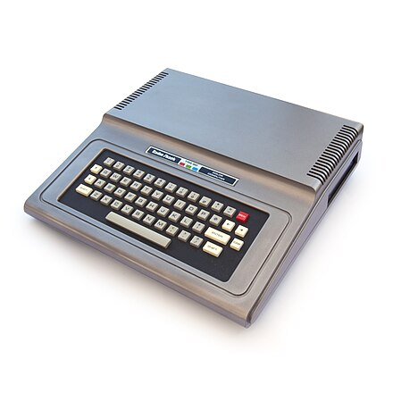
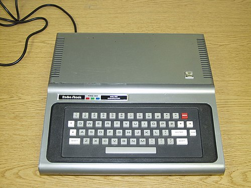
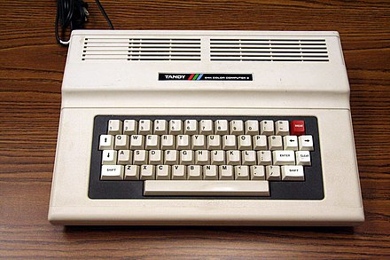
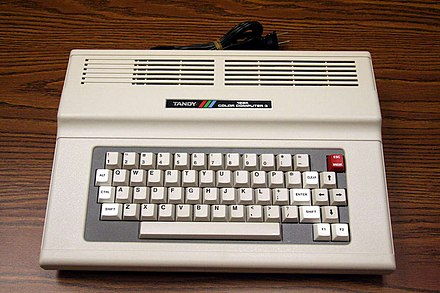

[Home](https://gotbasic.com) • [VB 7+](vb.md) • [VB 1-6](vb6.md) • [FB](freebasic.md) • [QB64](qb64.md) • [QB45](qb.md) • [GW-BASIC](gw-basic.md) • [Micro](micro.md) • [Retro](retro.md)

# RadioShack/Tandy Color Computer Series

## Emulators

- [Color Computer 2 Disk BASIC v1.1 circa 1982 (Archive.org)](https://archive.org/details/coco2cart_Color_Computer_Disk_BASIC_V1.1_1982_26-3022_Tandy): No need to download, start playing right away directly in your browser!
- [XRoar - Dragon & CoCo emulator](https://www.6809.org.uk/xroar): XRoar is a Dragon emulator for Linux, Unix, Mac OS X and Windows. Due to hardware similarities, XRoar also emulates the Tandy Colour Computer (CoCo) models 1 & 2.

## IDE (Windows)

- [PlayPi Games 6dev09](https://www.playpi.net/): *"Unleash the creativity with 6dev09, the game-changing IDE that transforms Color Computer and 6x09 programming and empowers your coding adventures! Experience seamless programming with 6dev09's robust support for both BASIC and Assembly languages, tailored for Color Computer and other 6x09 systems. Create and share cartridge ROMs and floppy images effortlessly, making it simple to bring your projects to life on MAME and other emulators or the Color Computer itself. Effortlessly manage complex projects through multiple tabs, allowing you to work on several files simultaneously within the same workspace."*
- [Phoenix IDE](http://www.cococommunity.net/product/phoenix-ide/)
- [Phoenix IDE Programming Application for the Tandy Color Computer (in BASIC)](https://youtu.be/WwE6WqpO9Dc)

*Please note that I haven't personally worked with either of the above as they are both paid products. But they do seem interesting...*

## Color Computer 1

- [CoCo SDC](http://cocosdc.blogspot.com/?fbclid=IwAR0JquoF2a1xcd-mzVY-7jAoVoz-dU0LeiBYaSDVoVb0TyAOWcRRnmCW1qA)

## Color Computer 2

- [Getting Started With Extended Color Basic (PDF)](http://www.colorcomputerarchive.com/coco/Documents/Manuals/Hardware/Getting%20Started%20With%20Extended%20Color%20Basic%20(Tandy).pdf)
- [The MOOH - Memory expansion for your Dragon or CoCo 1/2](http://tormod.me/mooh.html): The MOOH is a memory expansion cartridge board for the Dragon 32/64 and CoCo 1/2, adding 512 KB of RAM and a socket for up to 64 KB ROM. It also features an SPI interface and an SD-card slot.

## Color Computer 3

- [Programming in BASIC on the Tandy RadioShack TRS-80 Color Computer (YouTube)](https://www.youtube.com/playlist?list=PLDfh7JjQaSYA1fP5KwRiOwefFIIF1Alid&fbclid=IwAR02qFC8wrAq8cf6rO4KUGpKb62KE_xaRvrweKEIHlfmy3Mq7E84EO6718U): A step-by-step series on how to program the Color Computer using a Virtual Color Computer 3 (50 videos).
- [VCC Color Computer 3 Emulator (via archive.org)](https://web.archive.org/web/20181001201546/http://www.coco4.com/vcc/download.shtml)
- [How to get VGA for the CoCo 3](http://www.cococommunity.net/vga-for-the-coco-3/)
- [FPGA RGB2VGA](https://sites.google.com/site/tandycocoloco/rgb2vga)

## CocoPi3

[Zipped SD card image for Raspberry Pi 3](http://www.cocopi3.com/)
[Zipped SD card image for Raspberry Pi 3 (Alt)](http://ogsteviestrow.com/coco3/)
[CocoPi3 RPi3 Distribution](https://github.com/mrgw454/CocoPi3)
[HOWTO: Add new CocoPi3 git repo to CocoPi3 distribution](https://docs.google.com/document/d/1tTtsB-_iR7ECtPwY11cxcHeB9GSF8oaZszDFWWV3uNg)
[Ron Klien's YouTube Channel](https://www.youtube.com/channel/UCApGKXmQxldvBga3_CoeWXA)
[CocoPi3 Release Notes (CocoFEST 2019 Edition)](https://docs.google.com/document/d/1BkhNFjF3vd7sCoy1E6qa7TlPGUPdZMy2xz4EqZoyqtk)

## Hardware Emulation (FPGA)

- [How to build a Matchbox CoCo](http://www.cococommunity.net/how-to-build-your-own-coco-4/)
- [How to build a Mr. CoCo](http://www.cococommunity.net/how-to-build-a-mr-coco/)
- [A hardware keyboard encoder for the TRS-80 Color Computer](https://github.com/wyndec/CoCoKeys2USB)
- [HxC2001 - A Universal Floppy Drive Emulator](http://hxc2001.free.fr/floppy_drive_emulator/)

## Programs

- [Type-in Mania: An Interactive Database of Early Basic Computer Applications](http://faculty.cbu.ca/jgerrie/Home/Type-in-Mania.html?fbclid=IwAR3DAaO6aL8Lho29OYJgUzuyFLy7iSZTW5SA4nNyVVI9zazwNDf8wrDe0Og)

## Additional Information

- [TRS-80 Color Computer Archive](http://www.colorcomputerarchive.com/)
- [CoCoWares](http://cocowares.com/): The place to find all the Hardware, Software and Services currently available for the TRS-80 / Tandy Color Computer.
- [NitrOS-9 "Ease of Use" (EOU)](http://www.lcurtisboyle.com/nitros9/nitros9.html)
- [FuzixOS: Because Small Is Beautiful](https://github.com/EtchedPixels/FUZIX)
- [Fuzix Installer Project (FIP)](https://github.com/beretta42/fip): Tandy CoCo3 Specific.
- [YA-DOS-0.5a+ compatible HDD image](https://github.com/mrgw454/CCHDD)
- [The KEEP BBS](https://web2.thekeep.net/wp/)