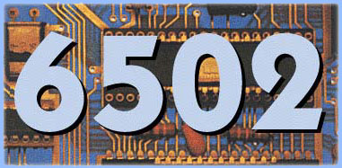
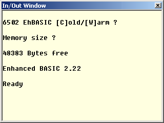
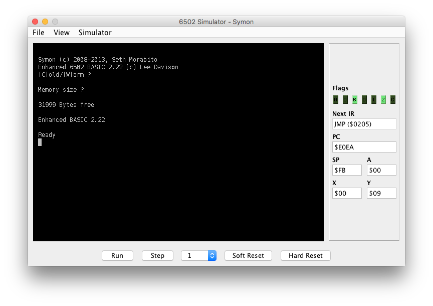

[Home](https://gotbasic.com) • [VB 7+](vb.md) • [VB 1-6](vb6.md) • [FB](freebasic.md) • [QB64](qb64.md) • [QB45](qb.md) • [GW-BASIC](gw-basic.md) • [Micro](micro.md) • [Retro](retro.md)

# ENHANCED 6502 BASIC (EhBASIC)



Enhanced BASIC is a BASIC interpreter for the 6502 and compatible microprocessors. It is constructed to be quick and powerful and easily ported to most 6502 systems. It requires few resources to run and includes instructions to facilitate easy low level handling of hardware devices. It also retains most of the powerful high level instructions from similar BASICs.

## Requirements

### Minimum

* 6502 processor.
* 10k ROM or RAM for the interpreter code.
* 1K of RAM from $0000.
* RS-232 I/O.

### Preferred

* 6502 or better processor (65c02, CCU3000, M38xx).
* 10k ROM or RAM for the interpreter code.
* RAM from $0000 to $BFFF (more with changes).
* Any character based I/O (e.g. RS-232, LCD/keyboard etc).

## Download

* [Download version 2.22](http://retro.hansotten.nl/uploads/leedavison/6502_EhBASIC_V2.22-master.zip)
* [Download version 2.09](http://retro.hansotten.nl/uploads/leedavison/ehbasicsourc209e.zip)

## Setup



Starting EhBASIC will mostly depend on how you set up your system to start it. The following assumes you are trying to run EhBASIC using the example monitor and Michal Kowalski’s 6502 simulator, though this should not differ too much from the startup of EhBASIC on a real system.

* Unpack the .zip source to a directory and run the 6502 simulator.
* Open `min_mon.asm` from the directory where you unzipped it.
* Select assemble `F7`.
* Run the debugger `F6`.
* Make sure the I/O window is open.
* Press `CTRL`, `SHIFT` and `R` to reset the simulated processor.

You should then be presented with the `[C]old/[W]arm` prompt as seen here. As the simulator has just been started you should now press `C` for a cold start. This should present you with the `Memory size ?` prompt. Now type either carriage return, in which case EhBASIC calculates available memory space automatically, or enter the total size of the memory in either decimal, hex or binary followed by a carriage return.

E.g. to set the physical memory size to 8k bytes.

In decimal ..

`Memory size ? 8192`

.. or in hex ..

`Memory size ? $2000`

.. or in binary.

`Memory size ? %10000000000000`

EhBASICs program memory is then allocated from Ram_base, which is usually $0300, up to the limit specified. Any remaining RAM, or any RAM not continuous from EhBASICs memory, may be used to contain user subroutines or data. If you did not enter a number greater than the minimum required to run EhBASIC, or there is not the minimum memory present, then EhBASIC will return to the `Memory size ?` prompt.

Do not type a number larger than the physical memory present. EhBASIC assumes you know what you are doing and does not check the specified memory size. Trying to use non-existent RAM will, at best, corrupt your string variables. This check can easily be implemented, the code is already in place but is commented out. See the source for more details.

There is no `Terminal width ?` prompt as with some BASICs, the default is for no terminal width limit to be set. However if you wish to set a terminal width, and a TAB step size, there is a `WIDTH` command available, see `WIDTH` in the EhBASIC language reference.If the memory sizing was successful then EhBASIC will respond with the total number of bytes available for both programs and variables and then the Ready prompt. The display should look something like the image on the right.

You are now ready to start using EhBASIC.

> I wasn't able to get the above instructions to work as prescribed. If you have any experience in getting the above to work, please reach out to me with instructions so that we can share this with everyone.

## SYMON



After some research was I able to find an emulator/simulator and functioning version of EhBASIC thanks to [Seth Morabito](https://github.com/sethm) and his [SYMON - A 6502 System Simulator](https://github.com/sethm/symon) project.

With that said, there was a bit of fiddling that was necessary to get things working...

* Download the latest release and place the resulting `.jar` file in a folder.
* You will need to download the `samples/ehbasic.rom` file from the repo and place this in the same folder as the `.jar` file.
* Rename `ehbasic.rom` to `rom.bin` (according to official instructions).

However, this is where I ran into a problem. The docs state that this file should automatically load but this doesn't appear to be the case (and I've reported the issue - awaiting a response). To work around this...

* For ease of use, I then renamed the release to `symon.jar`.
* Open a command prompt in this folder and type either `java -jar symon.jar -rom rom.bin` or `start symon.jar -rom rom.bin` to launch the simulator with this rom file.

From here you can follow the above instructions on usage.

> This, of course, assumes you have a recent version of Java installed.

### SYMON + EhBASIC Example

SYMON has a Composite Video (View -> Video Window) that emulates the output of the MOS 6545 CRT Controller. The following code can be entered in EhBASIC to fill the screen with all the available printable characters.

```vb
10 J = 0
20 FOR I = 28672 TO 29672
30 POKE I,J
40 IF J < 255 THEN J = J + 1 ELSE J = 0
50 NEXT I
60 END
```

## Documentation

* [How to use.](http://retro.hansotten.nl/6502-sbc/lee-davison-web-site/enhanced-6502-basic/how-to-use-ehbasic/)
* [Starting BASIC.](http://retro.hansotten.nl/6502-sbc/starting-ehbasic/)
* [Language reference.](http://retro.hansotten.nl/6502-sbc/lee-davison-web-site/enhanced-6502-basic/ehbasic-language-reference/)
* [EhBASIC reference manual in PDF format.](http://retro.hansotten.nl/uploads/leedavison/Enhanced_6502_BASIC_reference_manual.pdf)
* [Advanced techniques.](http://retro.hansotten.nl/6502-sbc/advanced-ehbasic-techniques/)
* [Extending CALL.](http://retro.hansotten.nl/6502-sbc/lee-davison-web-site/enhanced-6502-basic/ehbasic-extending-call/)
* [Using USR().](http://retro.hansotten.nl/6502-sbc/lee-davison-web-site/enhanced-6502-basic/ehbasic-using-usr/)

## Notes

* [Updates.](http://retro.hansotten.nl/6502-sbc/lee-davison-web-site/enhanced-6502-basic/update-ehbasic/)
* [Useful routines.](http://retro.hansotten.nl/6502-sbc/lee-davison-web-site/enhanced-6502-basic/ehbasic-useful-routines/)
* [Internals.](http://retro.hansotten.nl/6502-sbc/lee-davison-web-site/enhanced-6502-basic/ehbasic-internals/)
* [EhBASIC bug Ibuffs location.](http://retro.hansotten.nl/6502-sbc/lee-davison-web-site/enhanced-6502-basic/ehbasic-bug-ibuffs-location/)
* [Jeff Trantor made a CC65 assembler version of EhBASIC 2.22 for the Apple 1 and OSI 1P.](https://github.com/jefftranter/6502/tree/master/asm/ehbasic)
* [Notes on LOAD and SAVE.](http://retro.hansotten.nl/6502-sbc/lee-davison-web-site/enhanced-6502-basic/ehbasic-load-and-save-notes/)

## More Information

* [ENHANCED 6502 BASIC (Official).](http://retro.hansotten.nl/6502-sbc/lee-davison-web-site/enhanced-6502-basic/)
