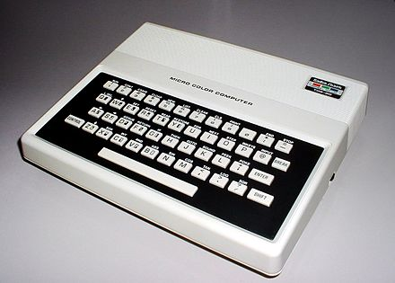

[Home](https://gotbasic.com) • [VB 7+](vb.md) • [VB 1-6](vb6.md) • [FB](freebasic.md) • [QB64](qb64.md) • [QB45](qb.md) • [GW-BASIC](gw-basic.md) • [Micro](micro.md) • [Retro](retro.md)

# RadioShack TRS-80 Color Computer MC-10

## Emulation

- [MC-10 Javascript Emulator](http://mc-10.com/): ([source](https://github.com/gregdionne/mc-10))
- [Virtual MC-10](https://www.zophar.net/trs80/virtual-mc-10.html)

## Documentation

- [Radio Shack TRS-80 MC-10 Micro Color Computer Operation and Language Reference Manual](https://colorcomputerarchive.com/repo/MC-10/Documents/Manuals/Hardware/MC-10%20Operation%20and%20Language%20Reference%20Manual/MC-10%20Operation%20and%20Language%20Reference%20Manual%20(Tandy).pdf)

## Blogs / Sites

- [TRS-80 MC-10 Programming Blog](http://jimgerrie.blogspot.ca/)
- [Charlie's TRS-80 MC-10 web page](https://chazbeenhad.tripod.com/): Software and Links for the TRS-80 Micro Color Computer Model MC-10.

## YouTube

- [Jim Gerrie](https://www.youtube.com/user/BenevolentChum)

## Code

- [Type-in Mania: An Interactive Database of Early Basic Computer Applications](http://faculty.cbu.ca/jgerrie/Home/Type-in-Mania.html)
- [Games and other software for the TRS-80 MC-10](https://github.com/jggames/trs80mc10)
- [mcbasic/examples](https://github.com/gregdionne/mcbasic/tree/main/examples): The files in the benchmark directory are small examples that can be run to compare the speed or performance against the MICROCOLOR BASIC interpreter. See the README.md file in that directory to learn more about them.

## Projects

- [trs80mc10](https://github.com/jggames/trs80mc10): Games and other software for the TRS-80 MC-10
- [mcbasic](https://github.com/gregdionne/mcbasic): A cross-compiler for MICROCOLOR BASIC 1.0 which runs on a stock TRS-80 MC-10 or on James Tamer's "Virtual MC-10" which runs on Windows and bundles a shareware Telemark cross-assembler.
- [tasm6801](https://github.com/gregdionne/tasm6801): Simple TASM-like cross-assembler for the Motorola 6801/6803 processor