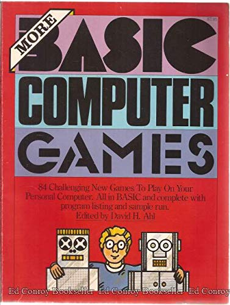

[Home](https://gotbasic.com) • [VB 7+](vb.md) • [VB 1-6](vb6.md) • [FB](freebasic.md) • [QB64](qb64.md) • [QB45](qb.md) • [GW-BASIC](gw-basic.md) • [Micro](micro.md) • Retro

# Personal Computers (Retro)

- Altair
  - [Micro-Soft Altair BASIC 3.2 Source](https://github.com/option8/Altair-BASIC)
- Apple
  - [Apple II](apple.md)
- Applied Technology
  - [MicroBee](microbee.md)
- Atari
  - [Atari 600XL/800XL](atari.md)
- Bally
  - [Astrocade](https://en.wikipedia.org/wiki/Bally_Astrocade#Astro_BASIC)
- BBC Micro
  - [Model B](bbc.md)
- Coleco
  - [ADAM - SmartBASIC](smartbasic.md)
- Commodore
  - [Amiga](amiga.md)
  - [C64](c64.md)
  - [PET](pet.md)
  - [VIC20](vic20.md)
- Compucolor
  - [Compucolor II Emulator](https://www.compucolor.org/emu/ccemu.html)
- IBM (and Compatibles)
  - [PCem](https://pcem-emulator.co.uk/)
  - [Faux86](https://github.com/paulwratt/Faux86) - A portable, open-source 8086 PC emulator for bare metal Raspberry Pi
  - [BASIC-DOS](https://github.com/jeffpar/basicdos) - PC DOS Reimagined
- Radio Shack (Tandy)
  - [TRS-80 Model I (Level I, Level II)](trs80.md)
  - [TRS-80 Model II](trs80.md)
  - [TRS-80 Model III](trs80.md)
  - [TRS-80 Model IV](trs80.md)
  - [Color Computer MC-10](mc10.md)
  - [Color Computer 1](coco.md)
  - [Color Computer 2](coco.md)
  - [Color Computer 3](coco.md)
- Z80
  - [BASIC-11 for the Z80](https://github.com/hperaza/BASIC-11-Z80)
  - [NASCOM ROM BASIC Version 4.7 - (C) 1978 Microsoft](https://github.com/feilipu/NASCOM_BASIC_4.7)
- ZX Spectrum
  - [Sinclair BASIC History](https://sinclair.wiki.zxnet.co.uk/wiki/Sinclair_BASIC_history)
  - [ZX Basic Wiki](https://zxbasic.readthedocs.io/en/docs/)
  - [Sinclair BASIC (Wikipedia)](https://en.wikipedia.org/wiki/Sinclair_BASIC)
  - [Sinclair ZX Spectrum Next - NEXTBASIC](https://www.specnext.com/nextbasic-commands/)
  - [JSSpeccy 3](https://jsspeccy.zxdemo.org/) - a ZX Spectrum emulator in the browser

# *Retro Modern*

This category is for languages/projects that aren't exactly retro but strive to provide the flavor of retro-ness on modern platforms.

- [BASIC8](https://github.com/paladin-t/b8): An integrated *Fantasy Computer* for game and other program development where you can create, share and play disks in a modern BASIC dialect with built-in tools for editing sprites, tiles, map, quantized, etc.

# Books

- [More BASIC Computer Games by David H. Ahl (PDF)](https://www.atariarchives.org/morebasicgames/index.php) - 1979

# Other

- [Emulators, Simulators, Etc.](emulators.md)
- [BASIC benchmark index for 8-bit computers](https://github.com/scruss/bench64)
- [The Oldschool PC Font Resource](https://int10h.org/oldschool-pc-fonts/fontlist/)
- [Perfect DOS VGA 437 Font](https://www.dafont.com/perfect-dos-vga-437.font)
- [ntvdmx64](https://github.com/leecher1337/ntvdmx64): Run Microsoft Windows NTVDM (DOS) on 64bit Editions
