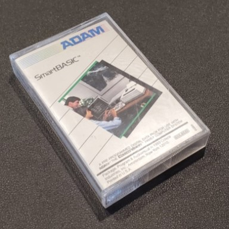

[Home](https://gotbasic.com) • [VB 7+](vb.md) • [VB 1-6](vb6.md) • [FB](freebasic.md) • [QB64](qb64.md) • [QB45](qb.md) • [GW-BASIC](gw-basic.md) • [Micro](micro.md) • [Retro](retro.md)

# SmartBASIC (Coleco ADAM)

> Unlike other computers at the time, the ADAM did not have its BASIC interpreter stored in ROM. Instead, it featured a built-in electronic typewriter and word processor, SmartWriter, as well as the Elementary Operating System (EOS) OS kernel and the 8 KB OS-7 ColecoVision operating system. The SmartBASIC interpreter was delivered on a Digital Data Pack tape cassette; this version of BASIC was designed to be mostly compatible with Applesoft BASIC. The interpreter was developed by Randall Hyde of Lazer Microsystems.

I found [this "Coding Horror" blog post](https://blog.codinghorror.com/the-cult-of-coleco-adam/) of which the comments are pretty negative toward the community at the time that still were interested in the ADAM. In this blog post though is:

> In 1995, if you are an active ADAM programmer, like me, there is no way that you can be doing it for hope of financial gain – by now, there's none to be had. I'm an ADAM programmer because I'm intrinsically interested in the ADAM. I write software for me, and if other people find it useful, that's great, but I'll program whether anybody else cares about what I'm doing or not. For me, it's been fun (though often challenging and frustrating) to learn about how the ADAM works, and how to make it do interesting things.

> Unfortunately, I have not found many other people like me in the ADAM community. There aren't many of us programmers left, for a variety of personal and professional reasons. I don't believe you need a Ph.D. in order to learn how to write your own software in SmartBASIC or even assembler, but most of you out there believe otherwise; and I can't overcome the strength of your belief. There are many practical benefits to doing your own programming, not the least of which is that you can make your program do exactly what you want it to do. More important nowadays, however, is that ADAM programming skills can be part of your maintenance toolkit. If all the ADAM newsletters disappear, all the ADAM BBSes go off-line, no more ADAMcons are held, and you can't find anybody else who has an ADAM, then you, like Robinson Crusoe, can be self-sufficient on your own desert island. For me, that is an important motivation – because I'm really worried that the ADAM is about to become a desert island.

> The ADAMcons are a public service to the ADAM community. They aren't supposed to turn a profit, but they have to break even. In order to break even, there has to be a certain critical mass of attendees. In order to make it worth someone's while, or some users group's while, to put effort into planning and running an ADAMcon, you'd like to see a little more than the bare minimum attendance. But I'm not sure that it's reasonable to expect much attendance at all. Already, the evidence is clear that there are not enough dollar votes to support new ADAM hardware and software development. What's the attraction of yet another ADAMcon? There won't be much new to see, the sessions will be pretty much the same as they've always been, most of the big-name personalities from the first 5 years of ADAM have moved on to other things, so those of you who like to hobnob with royalty will find only Johnny-come-latelies like me. Unless this is your first or second ADAMcon, everything is as familiar as an old shoe, only the city and hotel are different. Is it really worth $250 US for the same hamburger in a different bun?

> Well, it must be, since all of you are here now. Unless you are a first-timer just discovering that there is a wider ADAM world, like me at ADAMcon 04, you must admit that the ADAM per se is only a flimsy excuse for your attendance this year. The real reason you're here is social. At past ADAMcons, or via now- defunct newsletters, or through now-disconnected BBSes, you met people who have become your friends. The ADAM brought you together, originally for some concrete and practical purpose (such as, you wrote some software that I want to buy), but now the ADAM connection is a historical artifact. Some of you would keep in touch whether there were still ADAMcons or not, whether you ever used your ADAMs again or not.

-- by Richard Drushell at ADAMcon 7 in 1995.

And... in the comments to "Coding Horror"'s blog post, Richard continues...

> Yes, I gave that speech at ADAMcon 007 in 1995. Yes, I have been to every ADAMcon from IV to 17 (except 10), and was Chairman for ADAMcon XIII. Yes, I still use my ADAM. Yes, I will be at ADAMcon 18 in Chicago in July 2006. Yes, it is all about the people now, but we still bring real ADAMs and set them up and do stuff with them, even though many people bring laptops with emulators.

> Before the web, before the net, and even before BBSes, people who owned home computers had to form local user groups with actual in-person monthly meetings in order to get support for their particular model. This produced strong friendships which, in our case, have lasted for more than 20 years, even as the computers (and alas, some of the people themselves) have gone to the landfill.

> The ADAM, despite many faults, has interesting technical design features. Indeed, most home computers of that era, in the period of adaptive radiation before the great extinction caused by the emergence of the IBM PC standard, are similarly interesting and quirky on the inside. They are simple enough to learn everything about, and you can easily carry the whole machine around inside your head. That vanished from mainstream home computing about the time of Windows 3.1.

> Communities like our ADAM family are a product of that time, and as such look silly to people who have had Windows, Pentiums, and the Internet all their lives. Communities still form today around the same kinds of arcana as the ADAM, but these are not likely to be in-person. Communities all, just different communications media.

> I wouldn’t trade my 18-year hobby with the ADAM (which began when I rescued my Dad’s original Christmas 1984 ADAM from the dumpster) for anything. Hacking the ADAM has taught me stuff that I have used in my professional research and teaching, stuff that my CS and CE students never get taught by straight academic faculty. I owe lifelong friends, and my wife-to-be, to the machine that Art Greenberg (President of Coleco Industries) once described as “a typewriter that plays Donkey Kong”. Corny as it may sound, we ADAMites really are a family. Everyone should be so lucky as we are to have that at some point in their lives.

> *Rich* (March 2006)

- [ADAM SmartBASIC Programming Manual Revised Edition (PDF)](https://archive.org/details/coleco-adam-smart-basic-manual)
