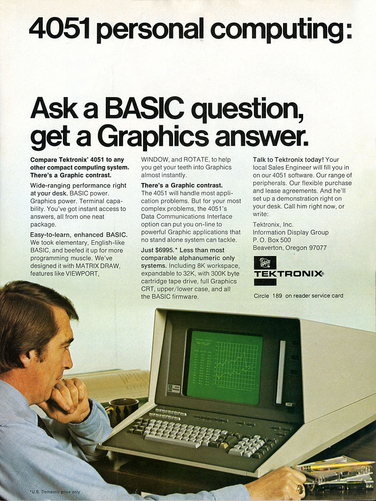

[Home](https://gotbasic.com) • [VB 7+](vb.md) • [VB 1-6](vb6.md) • [FB](freebasic.md) • [QB64](qb64.md) • [QB45](qb.md) • [GW-BASIC](gw-basic.md) • [Micro](micro.md) • [Retro](retro.md)

# Tektronix 4050 Series BASIC



The Tektronix 4050 all-in-one series of computers produced during the late 1970s and early 1980s with the display, keyboard, CPU and tape drive in a single desktop case. Additionally, utilized a GPIB parallel bus interface for connecting external devices. Due to the *storage tube* approach to the display, the effective resolution of the display was 1024 by 780; utilizing none of the memory of the machine - dedicating all of its memory to code execution. Later models could support a resolution of 4096 by 3072.

Thanks to the lack of flicker with the direct view storage tubes, the 405x computers can be frequently be seen in the 1978 TV series *Battlestar Galactica*.

The 4051 (released in 1975) has the following specs:

- Motorola 6800 at 1MHz
- 8KB RAM, expandable to 32KB
- Up to 32KB of ROM
- Six character sets in ROM
- Extended BASIC including vector drawing support
- Optional RS-232 interface
- Optional joystick interface
- Optional graphics tablet input device

## Videos

- [Tek 4051 Startup and Shutdown](https://www.youtube.com/watch?v=V6Vriat9IxA)
- Introduction to the Tektronix 4051
  - [Introduction and Quick Sample Programs](https://www.youtube.com/watch?v=xWrIS_l5HWk)
  - [Numeric Variables and Math Functions](https://www.youtube.com/watch?v=wZKfOTkEZKU)
  - [Program Control](https://www.youtube.com/watch?v=DvcFw9jPLEs)
  - [Graphics Commands](https://www.youtube.com/watch?v=-lUSDb-1NDg)
  - [Text Strings and Print Formatting](https://www.youtube.com/watch?v=V3ET9xRb82c)
  - [Sample Statistical/Graphics Programs](https://www.youtube.com/watch?v=tXeQoHw950E)

## Documentation

- [Tektronix 4051](http://archive.computerhistory.org/resources/text/Tektronix/Tektronix.4051.1976.102646254.pdf)
- [Tektronix 4051 Graphics System (Creative Computing Volume 2)](http://www.atariarchives.org/bcc2/showpage.php?page=282)
- [Tektronix 4052 System](https://www.electronixandmore.com/resources/teksystem/index.html)
- [070-2058-01 PLOT 50 Introduction to Programming in BASIC September 1978](http://www.bitsavers.org/pdf/tektronix/405x/070-2058-01_PLOT_50_Introduction_to_Programming_in_BASIC_Sep1978.pdf)
- [070-0142-02 Tek 4050 Series Basic Reference June 1983](http://www.bitsavers.org/pdf/tektronix/405x/070-2142-02_Tek_4050_Series_Basic_Reference_Jun83.pdf)

## 4051 BASIC Simulator

A 4051 BASIC Simulator that runs on Windows created by Brad Srebnik.

### Links

- [Tektronix 4051 BASIC Simulator (YouTube)](https://www.youtube.com/watch?v=a94uJjTOjTY)
- [Tek 4051 BASIC group (Facebook)](https://www.facebook.com/groups/1157781747606102)
- [Brad Srebnik (Facebook)](https://www.facebook.com/brad.srebnik.7)
- [Brad Srebnik (YouTube)](https://www.youtube.com/@AurelianDesignSeattle)

### More

(*The following is an edit of the email sent by Brad after you contact him.*)

The Tek 4051 BASIC Simulator can be downloaded from

(*link removed*)

Please do not distribute the simulator to others.  If you know someone who is interested in it, have them contact me by e-mail, or [message me on Facebook](https://www.facebook.com/brad.srebnik.7).

If you display the simulator publicly, credit it as follows:

"4051 BASIC Simulator provided courtesy of Brad Srebnik."

#### General Usage

The simulator only runs on Windows.

After downloading the zip file, unzip it and save in a folder.

Run the `Tek4051BASIC.exe` file to start the simulator.  It will slowly initiate the simulated storage tube display.  When it stabilizes, press the HOME PAGE key on the gray control window (or type PAGE on your keyboard and press enter).

There is a check box to turn off sound. It is best not to click that box when running a program in the simulator (it may crash).

If you want it to run faster than the normal 4051 speed, click the `Fast` check box.

If you have a low-resolution display you can click the Keys to Left check box to move the Keys window into view. Then un-check it again to move it back to the right of the main display window.

#### Running Commands and Programs

Now you can type BASIC commands.

Here's a short sample program (lower-case is OK):

```vb
100 PAGE 
110 SET DEGREES 
120 FOR X=10 TO 120 STEP 5 
130 MOVE X,30 
140 DRAW X,50+40*SIN(3*X) 
150 NEXT X 
```

If you make a mistake typing a line, you can use backspace or delete, or press `CLEAR` on the Keys window and start typing that line over again.

After you enter the program, type:

`RUN`

to run it.

See the `Versions.txt` file for the list of supported commands and fixes and improvements in the versions of the simulator.

There is a `SamplePrograms.txt` file that describes the sample programs in the zip file.  If you want to run one, the `.PGM` files must be in the same folder that you ran the simulator EXE from.

Then use the commands:

```txt
FIND [n]          example: FIND 1 
OLD 
RUN 
```

from within the simulator. `FIND` takes a while (simulator the original cartridge tape drive) so be patient.  You may think the simulator is not responding but it should come back after a minute or two.

Press `POWER` button to end - your program will be lost if not saved first (with `FIND [n]`, then `SAVE`).

Your screen resolution needs to be fairly good, or the control panel (`PAGE` key, etc.) will be off the screen.  Click the `POWER` button to end the program. Please let me know when you run it, what version of Windows you used, and if you had any problems.

Feel free to send any questions, bugs, or comments, but know that I'm not putting too much time into supporting it (adding additional commands, fixing minor bugs, etc.) at present. Once in a while I do some work to fix bugs and will try to send an e-mail out when there is an updated version available.

GPIB addressing is mostly not supported.

I can point you to PDF's of the old programming manuals for it on [bitsavers.org](http://www.bitsavers.org/pdf/tektronix/405x/). They are quite readable and mostly clear.  Also join the [Tek 4051 BASIC Facebook group](https://www.facebook.com/groups/1157781747606102) if you haven't already. And there are [six videos I put on YouTube](https://www.youtube.com/@AurelianDesignSeattle) describe some parts of Tek 4051 BASIC programming.  Feel free to suggest topics for additional videos.

Regards,

Brad Srebnik
