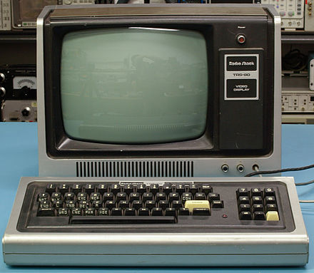
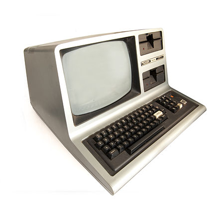
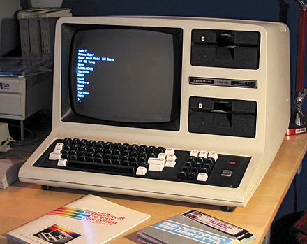
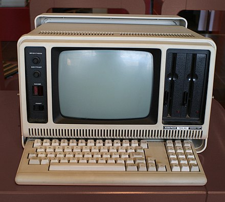

[Home](https://gotbasic.com) • [VB 7+](vb.md) • [VB 1-6](vb6.md) • [FB](freebasic.md) • [QB64](qb64.md) • [QB45](qb.md) • [GW-BASIC](gw-basic.md) • [Micro](micro.md) • [Retro](retro.md)

# RadioShack TRS-80

## LEVEL I

Level I BASIC is credited as being created by Steve Leininger. His involvement with the development of the TRS-80's BASIC language began before his employment with Tandy. While at National Semiconductor, Steve had written a draft of the NIBL (National Industrial Basic Language) BASIC interpreter for the SC/MP microprocessor. The NIBL interpreter was designed to be an efficient and compact implementation of BASIC for industrial applications.

When Steve joined Tandy, he was unable to bring the source code for the NIBL interpreter with him. As a result, he was faced with the challenge of creating a new implementation of BASIC for the TRS-80 from scratch. Steve initially attempted to hire a consultant to write the interpreter, but unfortunately, the consultant failed to deliver.

With time running out, Steve was forced to find an alternative solution. He turned to Li-Chen Wang's public domain version of Tiny BASIC as a starting point. Tiny BASIC was a simple implementation of BASIC that was designed to run on microcomputers with limited memory.

Steve adapted Tiny BASIC to fit the TRS-80's hardware and specifications, resulting in the first prototype of the TRS-80 Model I BASIC interpreter. This implementation of BASIC was incredibly compact, requiring only 2 KB of memory for the interpreter. This left an average of 2 KB of memory free for user programs in the common 4 KB memory layout of early computers. The compact nature of the BASIC interpreter was critical to the success of the TRS-80, as it allowed users to write and run programs on the machine without the need for additional memory upgrades or hardware modifications.

* [TRS-80 Model I Level I BASIC](https://en.wikipedia.org/wiki/Level_I_BASIC)

## Level II

* [TRS-80 Model I Level 2 BASIC Language Reference](https://www.trs-80.com/wordpress/info-level-2-basic-language/)

## Level III

## Emulators

* [trs80gp - A TRS-80 Model 1, 2, 3, 4, 12, 16, 6000, MC-10, DT-1, Videotex Emulator](http://48k.ca/trs80gp.html)
* [TRS-80 Model 1 on a PIC32 (hackaday.io)](https://hackaday.io/project/9077-trs-80-model-1-on-a-pic32#j-discussions-title)
* [Port of z80sim 1.17 to PIC32](https://github.com/TheCodeman/z80pack-1.17-ksd-pic32)

## Additional

* [TRS-OS](https://danielpaulmartin.com/home/research/?fbclid=IwAR0X-Isj8-H8Mf4j9byWtvYXLd1YJjlZ52vPKjrHBV2t4FrZsjh-RrIk5Z4)
* [Learn Assembly Programming With ChibiAkumas!](https://www.chibiakumas.com/ez80/?fbclid=IwAR1kUZ2JLkmRJMGTcbyEQ1a49O-Ztrx_bkhzAPf6Ti6X3fDYuOsFUfET4nA)
* [TRS-80 DOS - NEWDOS/80](https://www.trs-80.com/wordpress/dos-newdos80/)
* [A Tandy/RadioShack TRS-80 Model I Clone](https://www.glensstuff.com/trs80/trs80.htm)
* [TRS-OS](https://www.danielpaulmartin.com/home/research/?fbclid=IwAR1zBWi9dPDXrcvub0PH71vxegnvCC_M32XlGk15H0aVr8tKmCFb_n4tWn8)
* [Agon OSboot for TRS-OS](https://github.com/sijnstra/agon-projects/tree/main/OSboot)

