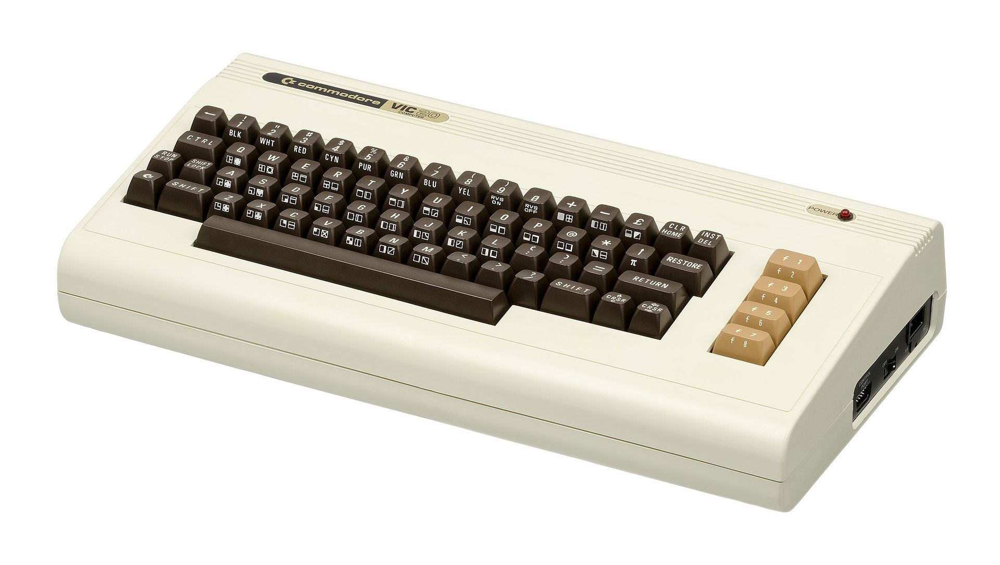

[Home](https://gotbasic.com) • [VB 7+](vb.md) • [VB 1-6](vb6.md) • [FB](freebasic.md) • [QB64](qb64.md) • [QB45](qb.md) • [GW-BASIC](gw-basic.md) • [Micro](micro.md) • [Retro](retro.md)

# Commodore VIC-20

- [WimBasic](https://wimbasic.webs.com/): Today's Extended Basic Level II extension for VIC-20 featuring SuperNumbers(tm).

