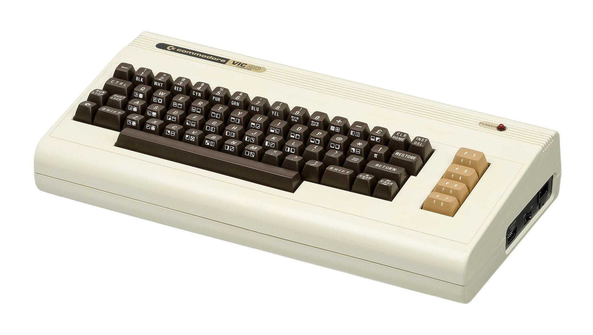

[Home](https://gotbasic.com) • [VB](vb.md) • [FB](freebasic.md) • [QB](qb.md) • [GW](gw-basic.md) • [Tiny](tiny.md) • [BBC](bbc.md) • [SpecBAS](specbas.md) • [A-Z](alphabetical.md) • [Platform](platform.md) • [Discord](https://discord.gg/AYcgDwERUU)

# Commodore VIC-20

- [WimBasic](https://wimbasic.webs.com/): Today's Extended Basic Level II extension for VIC-20 featuring SuperNumbers(tm).

